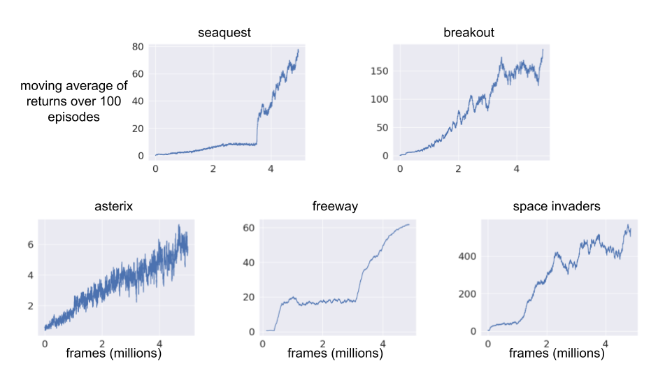

# DreamerV2 JAX+Haiku
An implementation of DreamerV2 written in JAX and Haiku. Preliminary experimental result are provided for the MinAtar testbed as a proof of concept.

## Usage
Using this repo requires JAX, Haiku, NumPy and OpenAI gym. The included config.json file specifies an experiment in MinAtar which will also require installation of MinAtar. A new training run can be performed with a command like the following:
```bash
python3 dreamer.py -c config.json -o dreamer.out -m dreamer.model -b dreamer.buffer -s 0
```
The flags have the following meaning:

-c specifies the configuration file, an example of which is provided in config.json.<br>
-o specifies where to save the output data.<br> 
-m specifies where to save the trained model.<br>
-b specifies where to save the final replay buffer.<br>
-s specifies the random seed.<br>
-l optionally indicates the directory of a trained model to initialize the model parameters.<br>

By default, the entire replay buffer is stored as JAX arrays in GPU memory. If you run out of GPU memory as a result you can either reduce `buffer_size` in the config file or specify `"cpu_replay": true` to store the replay buffer in RAM instead.

## Differences from Original DreamerV2 Implementation
This repo does not aim to precisely reproduce the original dreamer implementation available here: https://github.com/danijar/dreamerv2. 

One notable difference is the addition of a posterior entropy weight to the loss which encourages higher entropy latent state distributions. I found this to be very helpful for stability and overall performance. While a posterior entropy term is already present as part of the posterior KL divergence, it is counterbalanced by prior cross-entropy. This means that, in the absence of other loss terms, KL divergence is minimized when the prior and posterior match regardless of entropy. Including an additional entropy term means that the resulting loss would be minimized when the distributions match and have maximum entropy. Intuitively, this discourages premature convergence to sharply peaked latent distributions with potential benefits similar to adding an entropy regularization in actor-critic.  

Additionally, for the MinAtar environments, observations are explicitly modelled as arrays of Bernoulli variable, which may improve performance by exploiting the fact that observations in MinAtar are known to be binary, although I have not explicitly tested alternatives.

## Preliminary Results
The following plots display running average return as a function of training frame for each MinAtar game. The results seem fairly good, with the exception of asterix for which performance seems rather weak, however, they correspond to a single random seed with the hyperparameters provided in config.json. As such, they should not be used to draw any strong conclusions but are included here for proof of concept.

The raw data used to generate these results can be found in a google drive folder [here](https://drive.google.com/drive/folders/1fQiWf7JJBdq0PsQc1rMXoGkFlAD-1b2e?usp=sharing). Data, models and replay buffers are available for each game with the file name corresponding to the associated game.

## Analysis Scripts
The analysis directory contains some scripts for investigating the data and trained model resulting from a training run (for example the files available at the google drive link provided above). To plot a learning curve from a training run you can use a command like
```bash
python3 plot_return.py -o dreamer.out -w 100
````
The flag -w specifies how many episodes to perform a running average over. One can visualize a trained agent playing a game by running a command like
```bash
python3 agent_play.py -o dreamer.out -m dreamer.model -a

````
The flag -a means autoplay, which will step through frames automatically, if omitted the user must press a button to advance each frame. One can also visualize a trained agent playing within its own model of the environment as opposed to the true environment with a command like
```bash
python3 rollout_model.py -o dreamer.out -m dreamer.model -b dreamer.buffer -r 100 -i 10 -a

````
The model rollout is initialized with a sequence drawn from the replay buffer provided in a file specified with the -b flag. The flag -r specifies how many frames to rollout the model. The flag -i indicates how many frames to use to initialize the model state (which is produced by a recurrent network) before rolling out. The flag -a again indicates we wish to autoplay the rollout, rather than click through frames.

## Acknowledgements
I used the following repositories for reference when constructing this implementation:

- danijar's original TensorFlow implementation of DreamerV2: https://github.com/danijar/dreamerv2<br>
- RajGhugare19's PyTorch implementation of DreamerV2: https://github.com/RajGhugare19/dreamerv2<br>